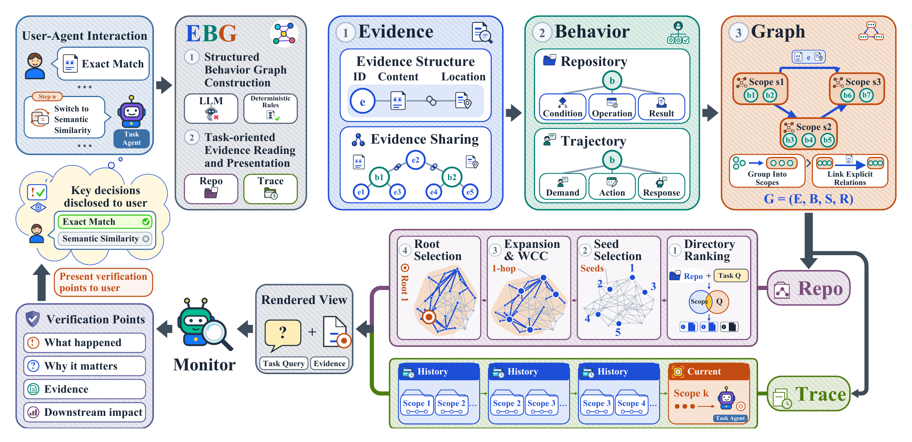

# EBG: Evidence-Grounded Behavior Graph

Code for **What Did the Agent Actually Do? Evidence-Grounded Oversight for
Long-Horizon Agents**, under review at ICLR 2027.

EBG is a training-free method that organizes source-linked evidence into
behaviors, scopes, and relations. Task-oriented views help a monitor identify
consequential decisions and locate supporting evidence.



**AgentMonBench** contains SpecGAP, SilentSwap, and FeedbackTrace, with 100
examples each. The main experiments use the 100 KEY FeedbackTrace Long inputs.
The benchmark is publicly available on
[Hugging Face](https://huggingface.co/datasets/ZhaoHongKang/AgentMonBench),
including complete evaluation data and browsable sample previews.

| Start here | Purpose |
| --- | --- |
| [Benchmark construction](benchmarks/README.md) | Construction code and data release |
| [Main experiments](experiments/main/README.md) | Main comparison, sample IDs, and score export |
| [Reproduce the paper](docs/reproducibility.md) | Data preparation, prediction, judging, and analysis |
| [Experiment index](experiments/README.md) | Paper tables and figures mapped to scripts |
| [Codex review harness](harness/README.md) | Independent application and five cases |
| [Method](docs/method.md) | EBG components and source-code mapping |

## Installation

Python 3.11+ is required for EBG. FeedbackTrace construction requires Python
3.12+. SilentSwap construction additionally requires Docker.

```bash
python -m venv .venv
# Linux/macOS: source .venv/bin/activate
# PowerShell: .venv/Scripts/Activate.ps1
python -m pip install -e ".[test,analysis]"
```

Run commands from the repository root. Use an editable checkout: prediction
prompts and schemas are loaded from this checkout. Construction tools and the
harness have separate dependencies.

## Offline example

```bash
python -m scripts.demo
python -m unittest discover -s tests -t . -q
```

The synthetic example needs no credentials or benchmark data. It builds a graph
and saves the result under `outputs/demo/`.

## Data and experiments

Download the public benchmark from
[Hugging Face](https://huggingface.co/datasets/ZhaoHongKang/AgentMonBench).
The release contains three archives (100 samples each), separate evaluation
annotations, and Data Studio preview tables. The pinned dataset revision is in
[dataset.yaml](benchmarks/dataset.yaml); the
[dataset card](benchmarks/dataset_card.md) describes the files.
Large datasets and raw runs are excluded from Git. This repository contains
the benchmark construction code and EBG implementation.
See [reproduction instructions](docs/reproducibility.md) for
local data preparation and model runs. Copy `.env.example` to `.env` and supply
your endpoint, model IDs, and credentials when running prediction or judging.
Using the released data does not require rerunning benchmark construction.

## Repository structure

```text
benchmarks/     Dataset builders, construction prompts, review procedures
asset/          Method figure and README assets
src/           EBG, AgentLoop, TraceReview, RepoGraph, evaluation utilities
evaluation/    Benchmark-specific judges
prompts/       Prediction and judging prompts
schemas/       Graph and prediction schemas
scripts/       Shared data and experiment entry points
experiments/   Main experiments and paper analyses
harness/       Codex application and case studies
results/       Aggregate tables and plotting inputs
docs/          Method, evaluation, and reproduction documentation
tests/         Offline regression tests
data/          Local datasets (ignored)
outputs/       Local generated files and runs (ignored)
```

## Citation and license

The paper is under anonymous review. Author information and the final paper
citation will be added after review.

Code is released under the [MIT License](LICENSE). Upstream datasets and
repository snapshots retain their own access conditions and licenses.
